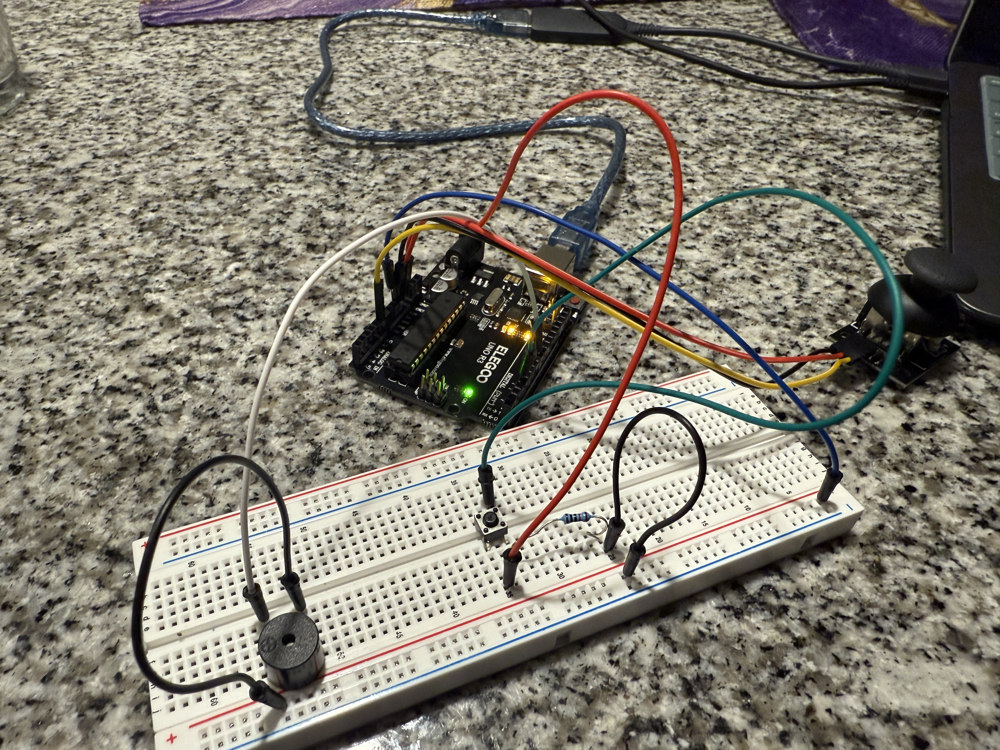

Shooters Shoot!

This is a simple game where the user is instructed to chose one of three colored basketballs, then use the Arduino board button and joystick to shoot the ball into the air as it moves. The goal is to score as many points as possible before the time runs out! The user will initally be prompted to connect to the Arduino board before initalizing the game, and then that prompt will go away.

There is a 20 second timer in the left corner of the screen, and in the right corner is the score board. To make it easy, the hitbox to score is the entire backboard.
The user will know they scored when the backboard sprite changes and the basket sound plays.
The background music is a loop of Tone.js chords that increases gradually in pitch as the timer runs out, as to get the player in the mood of scoring as many points as possible.
Additionally, on the Arduino board there is a buzzer that sounds in the last 3 seconds of the game, as a countdown tha mimics the buzzer in a real basketball game when the timer runs out. Score a buzzer beater!  

Here is a link to the gameplay: https://youtube.com/shorts/d_DGHA1oAmw?feature=share 

 ## Arduino Board Setup
 
